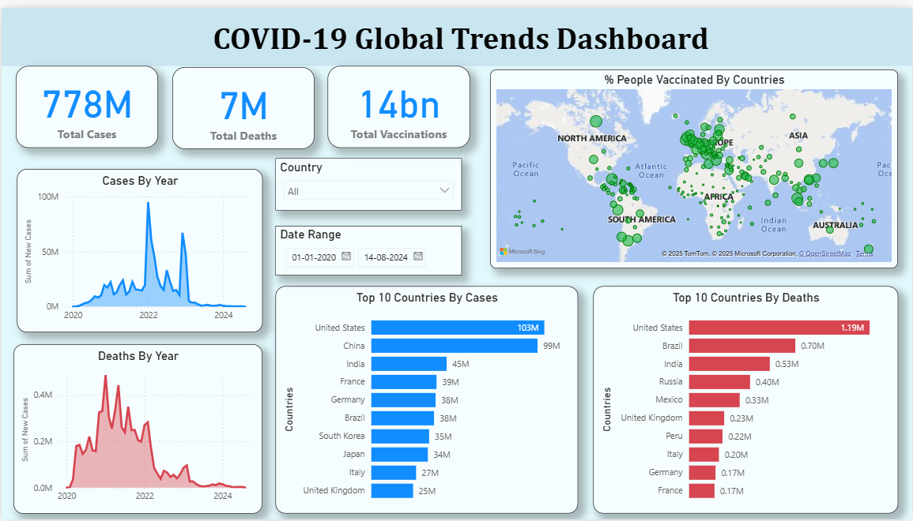

# COVID-19 Global Trends Dashboard

This project is an **interactive Power BI dashboard** that visualizes global COVID-19 trends, providing insights into total cases, deaths, vaccinations, and country-wise impacts from 2020 to 2024.

---

## Features

- **Total Overview**
  - Shows global totals for cases, deaths, and vaccinations.
- **Trends by Year**
  - Line charts for yearly progression of cases and deaths.
- **Vaccination Map**
  - Geographic visualization of vaccination percentages by country.
- **Top 10 Countries**
  - Bar charts ranking countries by total cases and deaths.
- **Interactive Filters**
  - Filter data by country and custom date ranges.

---

## Built With

- **Power BI** - for data modeling, DAX, and creating interactive visuals.

---

## Key Insights

- Identifies peak years for cases and deaths.
- Highlights disparities in vaccination coverage across regions.
- Ranks countries most affected by the pandemic.

---

## How to Use

1. Clone this repository.
2. Open the `.pbix` file using Power BI Desktop.
3. Use slicers to filter by country or adjust the date range.
4. Hover over visuals to see detailed tooltips and insights.

---

## Dashboard Preview

---

## Author

- **Akhil Garg**
- 🌐 [LinkedIn](www.linkedin.com/in/akhil-garg-5100002b1)

---

## Acknowledgments

- COVID-19 data sourced from publicly available global datasets.

---

## License

This project is open source under the [MIT License](LICENSE).

---
 *Feel free to fork, explore, or contribute. Pull requests are welcome!*
